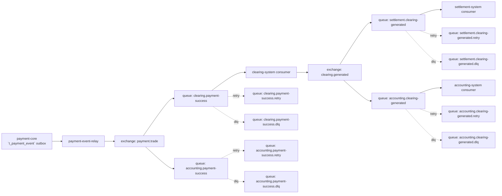

# 2026-07-31 真实 MQ 接入与跨系统补偿演练方案

## 1. 文档定位

本文档用于把当前 `test -> master` 的最大阻断项，从“口头上还缺 MQ 与补偿”收敛成可执行设计和演练清单。

本文档不是“已经接入真实 MQ”的完成证明，而是：

1. 基于四类资料整理出的正式技术方案。
2. 后续开发、联调、演练和门禁审计的共同依据。
3. `master / release` 前判断“真实 MQ 与补偿证据是否补齐”的检查基线。

## 2. 四类资料来源

### 2.1 图稿

- `/Users/abc123/图稿/支付系统.drawio`
- `/Users/abc123/图稿/结算系统原型.drawio`

提炼：

- 当前系统边界已拆为 `payment-core / clearing-system / settlement-system / accounting-system`。
- `payment-core` 负责支付事实与运营台账，`clearing-system` 负责清分，`settlement-system` 负责结算出款，`accounting-system` 负责账务落账。

### 2.2 笔记

- `/Users/abc123/笔记/支付系统.md`

来源事实：

- 笔记明确提出支付系统要支持“重复请求幂等控制、可恢复通讯故障合理重试、支付 MQ 重发、损失补偿、支付数据与内部账务核对、交易-清算-结算分层”。
- 笔记明确区分同步清算与异步清算，并把异常处理动作分成退款、状态更正、补发支付指令、支付 MQ 重发、账户余额补偿、服务补偿。

### 2.3 支付相关沉淀

- `/Users/abc123/workspace/支付相关/支付核心系统方案设计.md`
- `/Users/abc123/workspace/支付相关/清结算系统方案设计.md`
- `/Users/abc123/workspace/支付相关/账户账务系统方案设计.md`

来源事实：

- `支付核心系统方案设计` 强调支付核心与账务、清结算解耦，所有资金相关状态必须幂等、可追踪、可补偿，最终成功要允许被回调、主动查询、对账补单三种机制收敛确认。
- `清结算系统方案设计` 强调清结算必须处理清分、渠道清算、商户结算、在途与差错，并以事件或指令方式驱动下游。
- `账户账务系统方案设计` 强调账户系统采用追加式流水和账务事件模型，重复事件必须通过 `idempotency_key / source_event_id / biz_order_id` 护栏收口。

### 2.4 专家方法论

- `/Users/abc123/workspace/支付相关/陈天宇宙官网支付干货总结.md`

来源事实：

- 支付设计不能只盯接口和回调，而要把交易、支付、清算、结算、对账、账务放在同一链路上。
- 清结算必须和对账、账务一起设计，否则会遗漏在途资金、差错、手续费、长短款与实际到账差异。
- 账户账务的稳定三件套是余额、流水、交易；任何修正都应通过追加式冲正、调账、补偿完成，而不是覆盖历史事实。

## 3. 当前现状

### 3.1 当前代码事实

- `payment-core` 当前技术栈是 `Spring Boot 2.7.18 + MyBatis + MySQL + Spring AMQP`；已具备可切换的 `payment.success.v1` AMQP 出站 relay。
- `payment-core` 当前支付事件以 `t_payment_event` 作为支付事实台账，关键字段只有 `event_no / event_type / payment_order_id / biz_no / event_payload`。
- `payment-core` 默认仍通过 `payment.downstream.*` 直接发 HTTP 下游，以兼容未部署 broker 的本地环境；当 `HSP_PAYMENT_EVENT_DISPATCH_MODE=amqp` 时，relay 向 `payment.trade / payment.success.v1` 发布统一事件，并以 `eventNo` 作为 `messageId/correlationId` 等待 publisher confirm 后再回写 outbox 成功状态。
- `clearing-system` 已具备可切换的 `clearing.generated.v1` AMQP outbox relay；`settlement-system` 已具备对应消费者，`accounting-system` 暂仍使用 HTTP 下游派发。

### 3.2 当前已完成的应用层门禁

- `payment-core` 已有支付事件失败重试、重试耗尽进 `DEAD_LETTER`、非法事件拒绝、下游短路保护。
- `clearing-system` 已收口重复消费导致清分单和分账项膨胀。
- `accounting-system` 已收口重复事件导致重复入账。
- `settlement-system` 已收口重复清分事件导致重复生成结算单。

### 3.3 当前未完成的生产级能力

1. 没有真实消息代理运行证据。
2. `payment-core` 已具备 producer 侧 publisher confirm 配置和失败落库路径，但尚未完成下游 consumer ACK/NACK、消费组和 retry/DLQ 实机验证。
3. 没有跨系统补偿编排，只具备应用层重发和本地台账收口。
4. 没有真实 MQ 环境下的端到端演练证据。

## 4. 目标与非目标

### 4.1 目标

1. 把 `payment-core -> clearing-system -> settlement-system / accounting-system` 从 HTTP 直推升级为真实异步事件链路。
2. 保持支付事实、清分事实、账务事实、结算事实各自独立且可追溯。
3. 让失败重试、死信、补偿、人工介入都落到统一台账和任务中心。
4. 为 `test -> master` 提供可审计的运行证据。

### 4.2 非目标

1. 本轮不重做 `payment-core` 交易主流程。
2. 本轮不引入新的清分、结算、账务业务规则。
3. 本轮不把对账系统一起全量实现，只定义其后续接入点。

## 5. 推荐架构

### 5.1 推荐方案

设计建议：

- 推荐在当前 `Spring Boot 2.7.18` 基线上引入 `spring-boot-starter-amqp`，使用 RabbitMQ 作为第一版真实消息代理。
- 推荐优先采用 `topic exchange + durable queue + dead-letter exchange` 组合，不先做过度抽象。
- 推荐继续保留 `t_payment_event` 作为 outbox 真相表，再增加“出站 relay -> broker -> consumer”链路，而不是把数据库台账废掉。

推荐理由：

1. 当前代码已经有 outbox、失败重试、死信状态和任务中心，适合平滑升级为“本地 outbox + broker relay”模式。
2. RabbitMQ 的 ACK/NACK、DLX、TTL、routing key 更贴合当前“支付成功事件 -> 多系统消费”的治理诉求。
3. 当前项目还是单体 Spring Boot + MyBatis 风格，引入 AMQP 的改动面相对可控。

### 5.2 目标事件拓扑

### 5.3 事件主题建议

| 业务事实 | exchange | routing key | producer | consumer |
| --- | --- | --- | --- | --- |
| 支付成功 | `payment.trade` | `payment.success.v1` | `payment-core` | `clearing-system`、`accounting-system` |
| 清分生成 | `clearing.trade` | `clearing.generated.v1` | `clearing-system` | `settlement-system`、`accounting-system` |
| 退款成功 | `payment.refund` | `refund.success.v1` | `payment-core` | 后续退款/账务/对账消费者 |

## 6. 模块职责

### 6.1 payment-core

1. 继续维护 `t_payment_event` 作为支付事实 outbox。
2. 新增 relay 任务，仅负责把 `PENDING / FAILED` 事件投递到 broker，不直接感知下游业务。
3. 记录 broker 投递结果、下次重试时间、死信原因、最近一次投递批次号。
4. 提供任务中心补偿入口：重投递、重置重试、转人工处理。

### 6.2 clearing-system

1. 订阅 `payment.success.v1`。当前已实现可开关的 `clearing.payment-success` AMQP consumer。
2. 先以 `paymentOrderId` 做消费幂等，再执行业务清分；业务成功后手动 ACK。
3. 消费异常按 `x-retry-count` 发送到消费者独立的 `payment.trade.retry`，达到上限发送到 `payment.trade.dlq`；若重投失败则 NACK 原消息并 requeue。
4. 清分成功时会与清分事实同事务创建 `CLEARING_GENERATED` outbox；当 `HSP_CLEARING_AMQP_DISPATCH_MODE=amqp` 时，relay 向 `clearing.trade / clearing.generated.v1` 发布，并在 publisher confirm 后更新投递状态。HTTP 模式暂时保留为兼容回退。

### 6.3 settlement-system

1. 当 `HSP_SETTLEMENT_AMQP_ENABLED=true` 时，订阅 `clearing.generated.v1` 的 `settlement.clearing-generated` 队列。
2. 复用既有的 `clearingNo + targetType + targetNo` 消费幂等服务；业务成功后手动 ACK，不在 listener 内触发出款。
3. 消费异常按 `x-retry-count` 转到独立 `clearing.trade.retry`，达到上限转 `clearing.trade.dlq`；重投失败时 NACK 原消息并 requeue。
3. 若消费成功，只生成结算事实，不在 MQ 消费线程里直接做复杂出款。
4. 出款仍由结算批次或任务中心驱动，避免 MQ 消费线程承担长事务。

### 6.4 accounting-system

1. 订阅 `payment.success.v1` 和 `clearing.generated.v1`。当前已实现可开关的 `accounting.payment-success` AMQP consumer。
2. 以 `accountNo + bizType + bizNo` 做账务流水幂等；业务成功后才手动 ACK。
3. 消费异常按 `x-retry-count` 发送到 `payment.trade.retry`，达到上限发送到 `payment.trade.dlq`；重投失败时 NACK 原消息并 requeue。
4. `clearing.generated.v1` 的 AMQP consumer 尚未实现，当前 HTTP 接口继续保留作为兼容入口。

## 7. 事件与数据模型增强

### 7.1 payment-core `t_payment_event` 建议新增字段

| 字段 | 用途 |
| --- | --- |
| `event_topic` | 事件主题，已有语义保留 |
| `exchange_name` | 目标 exchange |
| `routing_key` | 目标 routing key |
| `publish_batch_no` | 某次 relay 批次号 |
| `broker_message_id` | broker 消息标识 |
| `consumer_group` | 目标消费组/目标队列标识 |
| `last_error_code` | 最近一次失败码 |
| `last_error_message` | 最近一次失败摘要 |
| `dead_letter_reason` | 进入死信原因 |
| `published_at` | 最近一次成功投递时间 |
| `acked_at` | 若后续补订阅确认，可记录确认时间 |

### 7.2 消费端建议新增标准字段

| 系统 | 表 | 新增字段 |
| --- | --- | --- |
| `clearing-system` | 事件/清分表 | `source_event_no`、`source_message_id`、`consume_attempt` |
| `settlement-system` | 结算事件/结算单表 | `source_event_no`、`source_message_id`、`consume_attempt` |
| `accounting-system` | 账务事件/流水表 | `source_event_no`、`source_message_id`、`consume_attempt` |

### 7.3 幂等键建议

| 链路 | 幂等键 |
| --- | --- |
| 支付成功 -> 清分 | `paymentOrderId` |
| 支付成功 -> 账务 | `accountNo + PAYMENT_SUCCESS_EVENT + paymentOrderId` |
| 清分生成 -> 结算 | `clearingNo + targetType + targetNo` |
| 清分生成 -> 账务 | `accountNo + CLEARING_GENERATED_EVENT + clearingOrderNo` |
| 退款成功 -> 后续系统 | `refundOrderId` |

## 8. 一致性、重试、死信与补偿

### 8.1 一致性策略

设计建议：

1. 写业务事实和写 outbox 必须同本地事务提交。
2. relay 从 outbox 拉取待投递事件，成功后只更新投递状态，不补写业务事实。
3. consumer 成功处理业务并提交本地事务后才 ACK。
4. 任何跨系统修复都通过“重发事件 / 反向冲正 / 调账 / 重建结算单”完成，不覆盖历史记录。

### 8.2 重试策略

| 层级 | 建议 |
| --- | --- |
| producer relay | 立即失败后指数退避，建议 `1m / 5m / 15m` |
| consumer 业务失败 | 进入 retry queue，建议 `5m / 15m / 60m` |
| 超过最大次数 | 转入 DLQ，并落库 `DEAD_LETTER` |
| 人工补偿 | 任务中心触发重发或业务补偿，必须留痕 |

### 8.3 死信进入条件

1. 下游服务不可用且超过最大重试次数。
2. 消息格式非法且无法自动修复。
3. 幂等冲突或关键主数据缺失，需要人工介入。
4. 业务状态机不允许继续推进。

### 8.4 补偿策略

#### payment-core

- 事件只投递到了 broker，但 clearing/accounting 未消费：由 consumer retry / dlq 处理，不回滚支付成功事实。
- 事件台账长期 `DEAD_LETTER`：由任务中心人工重发。

#### clearing-system

- 清分失败：可重试消费；若数据问题无法自动修复，转 `clearing` 补偿工单。
- 清分成功但后续下游未消费：不重做清分，只重发 `CLEARING_GENERATED`。

#### settlement-system

- 重复消息：幂等拒绝并 ACK。
- 结算单生成成功但后续出款失败：通过结算任务中心重试，不反向删除结算单。

#### accounting-system

- 账务已落流水：重复消息直接 ACK。
- 账务失败且未落账：允许 retry。
- 若出现部分落账：必须通过冲正或调账单补偿，不允许改历史流水。

## 9. 安全与运维

### 9.1 安全

1. MQ 连接凭证通过环境变量管理，不写死在仓库。
2. 生产环境必须区分 `dev / test / pre / prod` 的 vhost 或 namespace。
3. 消息体只传业务必要字段，敏感数据继续留在业务库按单号回查。

### 9.2 观测指标

1. outbox 待投递数量
2. broker 发布失败数量
3. retry queue 堆积数量
4. dlq 堆积数量
5. 每个 consumer 的 ACK / NACK / reject 数量
6. 补偿任务成功率
7. 同一业务单号的重复消费命中数

### 9.3 告警建议

1. 任一 DLQ 堆积 > `0` 且持续 `15` 分钟报警
2. 任一 retry queue 积压超过阈值报警
3. outbox `PENDING/FAILED` 超过阈值报警
4. 同一 routing key 连续失败率超过阈值报警

## 10. 演练方案

### 10.1 环境前置

1. 搭建真实 RabbitMQ 测试环境。
2. 配置 `payment-core / clearing-system / settlement-system / accounting-system` 的 broker 连接。
3. 补齐队列、exchange、routing key、DLQ 和 retry queue 初始化脚本。
4. 打开各系统的消费日志、事件台账和任务中心补偿入口。

仓库已提供可重复启动的测试环境骨架：

- `infra/rabbitmq/docker-compose.yml`：RabbitMQ 3.13 management 容器编排。
- `infra/rabbitmq/definitions.json`：支付成功、清分生成的主队列、retry queue、DLQ、exchange 和 binding。
- `infra/rabbitmq/README.md`：启动方式、拓扑边界和演练规则。
- `docs/2026-07-31-MQ补偿演练记录模板.md`：真实 broker 演练的证据模板。

该骨架只解决环境与拓扑可复现性，不能替代四个系统接入 AMQP、真实发布确认和消费者 ACK/NACK 的运行证据。

### 10.2 必做演练场景

| 场景 | 目标 | 通过标准 |
| --- | --- | --- |
| 正常支付成功链路 | 验证 `payment-core -> clearing -> settlement/accounting` 全链路异步自动推进 | 四系统台账完整，状态一致 |
| broker 暂停后恢复 | 验证 outbox 与 relay 可恢复 | 恢复后自动补投，无重复业务结果 |
| clearing consumer 失败重试 | 验证 retry queue | 达到预期重试次数后成功或转 DLQ |
| accounting 重复消费 | 验证账务幂等 | 余额与流水不重复增加 |
| settlement 重复消费 | 验证结算幂等 | 结算单与明细不重复生成 |
| 死信转人工补偿 | 验证 DLQ -> 任务中心 | 人工补偿后状态收口并留痕 |
| 下游主数据缺失 | 验证不可自动修复场景 | 正确进入人工介入队列 |

### 10.3 演练输出物

1. broker 队列截图或指标快照
2. 四系统数据库台账查询结果
3. retry / dlq 消息数量变化记录
4. 任务中心补偿操作记录
5. 演练步骤、输入单号、预期与实际结果对照表

## 11. 与门禁和发布的关系

### 11.1 满足 `test -> master` 前，至少要补齐

1. 真实 broker 环境存在且可访问。
2. 至少 1 轮完整支付成功链路异步自动推进演练。
3. 至少 1 轮失败重试演练。
4. 至少 1 轮死信转人工补偿演练。
5. 四系统数据库与任务台账可证明没有重复入账、重复清分、重复结算。

### 11.2 仍不足以直接 `release/*` 的项

即使 MQ 与补偿演练通过，仍需继续补：

1. `test` 冻结版整包复核结论
2. 正式发布文档
3. 数据库变更、接口变更、前端入口变更、回滚与发布后验证清单

## 12. 当前结论

截至 `2026-07-31`：

1. 当前仓库已经具备应用层 outbox、失败重试、死信状态和下游幂等护栏，但还不是生产级消息总线交付。
2. 本文档给出了后续真实 MQ 接入和跨系统补偿演练的推荐落地方式。
3. 在真实 MQ 环境、补偿演练证据和最终冻结复核补齐之前，仍不满足 `test -> master`，也不基于 `master` 产出正式 `release/*` 文档和版本。
