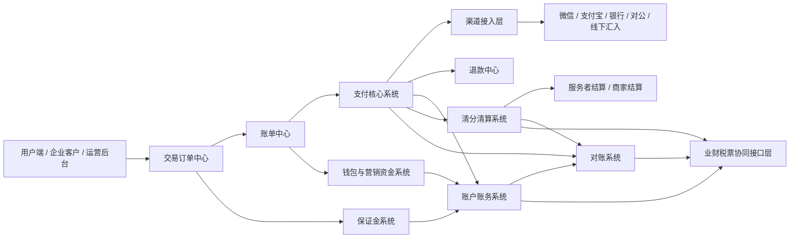

# 家政支付系统整体架构与实现目标

## 1. 文档定位

本文档是 `home-service-payment-system` 项目的总纲文档。

用途：

- 说明为什么要建设这个系统
- 说明系统最终要做到什么程度
- 说明当前项目的实施顺序
- 作为 Git 仓库的长期基线文档

适用对象：

- 业务负责人
- 财务产品经理
- 支付产品经理
- 前端开发
- 后端开发
- 测试工程师

## 2. 项目背景

公司业务是家政服务，交易具有明显的履约属性，不是简单的一次性电商收款。

典型业务特点包括：

- 用户先下单再预约服务
- 服务开始和完成时间会影响资金归属
- 可能存在补差价、取消退款、投诉赔付
- 平台需要给服务者结算
- 平台需要抽佣、承担补贴、处理保证金和欠款
- 财务需要做渠道对账、平台对账、结算核对

因此，这个项目的目标不是只做一个“收银台”或“支付成功页”，而是建设一套完整的家政支付资金平台。

## 3. 最终实现目标

本项目最终要落地的不是单点功能，而是一套可运行、可扩展、可持续演进的支付中台，覆盖以下能力：

1. 支付核心系统
2. 账户账务系统
3. 清分清算系统
4. 服务者结算系统
5. 商家结算系统
6. 退款中心
7. 对账系统
8. 保证金系统
9. 钱包与营销资金系统
10. 线下汇入与对公收款系统
11. 支付配置中心
12. 业财税票协同接口层

最终希望达到的效果是：

- 产品可以直接基于文档继续拆需求
- 前端可以直接按页面说明开发后台系统
- 后端可以直接按接口、对象模型、数据库模型开发
- 财务可以基于系统做真实的资金管理、结算、对账与差错处理

## 4. 项目实现原则

### 4.1 先系统、后页面

开发顺序以系统边界为主，不以“页面数量”为主。

### 4.2 先主链路、后复杂场景

先打通：

- 订单
- 账单
- 支付单
- 退款单
- 结算单

再逐步引入：

- 账务分录
- 清分规则
- 对账差异
- 保证金扣罚
- 营销资金

### 4.3 先可运行、后完美

每一期都必须能形成真实可运行的版本，而不是只停留在图纸和文档。

### 4.4 先统一模型、后扩业务

订单、账单、支付单、退款单、结算单、账户流水等主对象必须先固定，不然后续很容易失控。

## 5. 总体系统架构

## 6. 技术实现目标

### 6.1 前端目标

- 使用 `Vue 3 + Vite + Vue Router`
- 先建设统一后台管理台
- 后续逐步扩展到支付运营、退款运营、结算运营、对账运营、保证金运营等后台页面

### 6.2 后端目标

- 使用 `Java 8 + Spring Boot 2.7`
- 先形成清晰的 controller/service/repository/common 分层
- 后续接入数据库、任务调度、状态流转、审计日志、对账处理

### 6.3 文档目标

项目中的文档不是附属品，而是开发输入的一部分。

当前至少要长期维护以下几类文档：

- 总体方案
- 分期建设方案
- PRD
- 前端页面与交互说明
- 后端接口与数据设计

## 7. 实施顺序

### 一期：支付核心系统 MVP

目标：

- 建立家政支付后台的最小可运行系统
- 先打通工作台、订单中心、支付单管理
- 预留退款和结算入口

当前项目正处于这一期。

### 二期：账户账务与清结算

目标：

- 建立账户余额、流水、记账、清分、结算能力

### 三期：退款、对账、保证金、配置中心

目标：

- 建立完整逆向交易、资金核对和运营配置能力

### 四期：钱包、营销、线下汇入、二清监管、业财协同

目标：

- 建成完整支付资金平台

## 8. 当前仓库的实现目标

当前这个 Git 仓库的短期目标非常明确：

1. 先把一期工程文档固化
2. 先把前后端骨架跑通
3. 先把基础查询页面和查询接口做好
4. 再继续进入二期系统开发

也就是说，当前仓库不是在“随便搭个 Demo”，而是在建设完整家政支付平台的第一阶段正式工程。

## 9. 与已有业务文档的关系

本仓库内的开发文档，来源于以下母稿：

- `/Users/abc123/workspace/支付相关/家政服务支付系统总体方案.md`
- `/Users/abc123/workspace/支付相关/家政支付系统PRD版.md`
- `/Users/abc123/workspace/支付相关/家政支付系统前端后台页面与交互说明.md`

仓库内文档承担的是“把母稿转成可开发项目文档”的职责。

## 10. 结论

这个项目的实现目标，不是简单做几个支付页面，而是逐步建设一个可支撑家政公司真实业务的资金平台。

从今天开始，这个 Git 仓库将作为正式开发载体，后续每一轮文档补充、代码开发、结构调整，都应该围绕这个目标推进。
